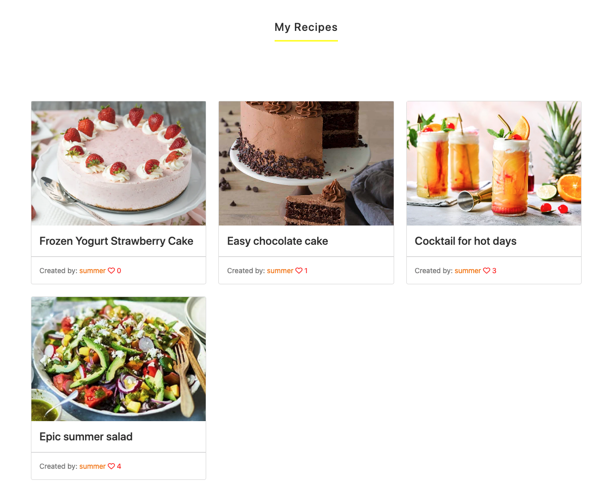
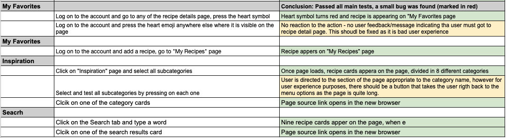

# Juicy Recipes

Link to the live project: [here](https://juicy-recipes.herokuapp.com/)

The API 

## Table of Contents 

- [Introduction](#introduction)
- [Features](#features)
- [Wireframes](#wireframes)
- [Design](#design)
- [Database Desing](#database-design)
- [Technologies](#technologies)
- [Testing](#testing)
- [Issues and bugs](#issues-and-bugs)
- [Deployment](#deployment)
- [Credits](#credits)

## Introduction

Juicy Recipes is a platform for users to create and share recipes and interact with other users.
Platform is built using Django Python-based framework, additionally Javascript is used to import and dissplay results from [Edamam API](https://www.edamam.comgclid=EAIaIQobChMIzLWV0qXL-AIVy-vtCh10Hw_ZEAAYASAAEgIS3vD_BwE) search results.

## Features

### Home Page

#### Navigation bar
  - Navigation bar is displayed on all pages providing access to all menu items to users on all pages
  - The list of menu items will change dependign on if the user is logged in, for example, if the user is logged in, then "logout" option will be presented. Also additional menu items will be presented to the logged in users such as "My Favorites", "Add Recipe" and "My Recipes"
  - The nav items are interactive which means that once the user hovers over the items, yellow underline appears to indicate that the item is clickable
  - The navigation menu is responsive, which means it will change to hamburger menu when viewed on smaller screens

#### Hero Image
  - Hero image is presented on home landing page, which is intended to inform the user what kind of website this is and what it is about.

### Recipes
  - Home page lists all user recipes that have been posted on Juicy Recipes site by all users, it is easy to browse through the paginated pages without getting lost on the page
  - User can see the likes and comments for each recipe on the all recipes view, this helps the user which recipe is most liked by other users 

#### Footer
  - Footer is visible at the bottom of all pages, it matched the color and design feel of the rest of the site
  - It includes additional information about thw site and useful socal links that when clicked will be opened in a new browser

### Inspiration Page
  - Page consists of a list of reciipes organised in 8 different categories from Edamam API request, this lets the user to get some inspiration and see what recipes are available elsewhere. Content is orgnised in a easy to read format, familiar to the user recipes that are available on the other pages.
  - When user clicks on on of the recipes, new page opens where recipe is publihsed, user can read more about it and make their own version of it and then post the recipe on Juicy recipes site whilst referncing the source page.

### Search Page
  - Search page has an input field presented as a main item on the page, this helps the user to easily understand that they can search for any recipes
  - Results are presented in a familiar design cards, with the source infomation rigth at the bottom, which helps the user to choose which recipes to pick. 
  - The Search option on Juicy Recipes site lets the user to see the photo of the recipe result straight away, which helpS the user to quickly find what they like without browsing through many sites and spending time.

### My favorites
  - My favorites page consist of recipes that logged in user have liked/favorited, this lets the user to easily find the recipes they have liked
  - Users can unlike the recipe, which will remove the recipe from the "My Favorites" page

### My Recipes
  - My Recipes page consist of recipes logged in user has created, this lets the user to overview the list of their recipes and easily and quickly access recipes detail page to make edits or delete the recipe
  - By vieiwng this page users can easily overview how many likes and comments each of their created recipe has.

### Add Recipe
  - This page presents a form to a user, each field has a description at the top of it, so that users can easily understand what they need to do for each field.
  - Placeholder photo is added to the recipe if the user fails to add a recipe at the time, this encourages user to post the recipes in case the image is not available straight away. They can uplaod the actual photo later on when clicking on "Edit" option on recipe detail page.
  - When "Submit" button is clicked user is directed to "My Recipes" page and user feedback message appears at the top of the page indicating that recipe has been posted, which assures the user that recipe has been published and enables user to immidiately view it on the page where they are directed to.

### Recipe Detail Page
  - Each user recipe page has it's own detail page, whcih lets the user to view each individual recipe details on a seperate page where full content is visible. Information is organsised in sections that lets the user to easily navigate to the information they want to find.
  - The page has the like and comment options that lets the user to interact with the content
  - If logged in user is vieiwng their own recipe there will be "Edit" and "Delete" options presented to the user which gived the user control over the content they have published
  - At the bottom of the recipe details page a comment section is available to users to view user converstaions.
  - If the user is logged in there is an option to leave a comments which lets the user to interact with other users

### Comments
  - Each recipe detail page displays comments section at the bottom. All site users can view all comments, but only the logged in users can leave a comment.
  - Each comment needs approval, so that admin users have control of comment section and can filter out comments thta are not appropriate

### Accounts

#### Register Page
  - The register page is available to all users and the link is presented each time a unlogges user is trying to access content that is available only for registered users
  - Sign-up is easy withouth email verification which enables the user to quickly access full functionallity of the site

#### Login Page
  - The login is userd for registered users to access the site
  - If incorrect login details will be entered user will be notified, which lets the user to understand why they have not been logged in.
  - If the log in details ahve been eneterd successfully, then user will be notified with a message appearing at the top of the page which will then time out after 3 seconds.

#### Log out Page
  - When user will click on this item on the menu bar, another page will open up asking the user if they want to log out, this lets the user to controld their action, in case if they have pressed the button by accident.
  - If the user has logged out, a message will appear at the top of the page advising that, which ensures the user that thir account is safe.

### Features to add
  - Add category option for user recipes, so that users can filter the categories and quickly find what they are looking for
  - Add photo upload option to comment section, so that users can share their own version of the recipe
  - Contact Us section, so that users can get in contact with site admins

[Back to top ⇧](#juicy-recipes)

## Database Design

[Back to top ⇧](#juicy-recipes)

## Technologies

### Main Technologies

- [HTML5](https://en.wikipedia.org/wiki/HTML5) used to build the structure of the site.
- [CSS3](https://en.wikipedia.org/wiki/Cascading_Style_Sheets) used to style the appearance of the elements
- [Javascript](https://en.wikipedia.org/wiki/JavaScript) used to fetch Edamam API data in Search and Inspiration pages. Additionally it was used to time out user feedback messages and get the user id from the front end when adding recipes.
- [Django](https://www.djangoproject.com/),[Python](https://www.python.org/) based framework was used to build the model based application, so that data can be created, edited, viewed and deleted from the database.
- [Cloudinary](https://cloudinary.com/) used to store images.
- [PostgreSQL](https://www.postgresql.org/) - database where content is saved, this is connected through Heroku

### Other Libraries and Softwares

- [Git](https://git-scm.com/) used for ersion control
- [GitHub](https://github.com/) used to organise code, add user stories, version control, deployment
- [Gitpod](https://www.gitpod.io/) used for building the project

#### Design
- [Balsamiq](https://balsamiq.com/) used to draw the structure of planned design
- [Google Fonts](https://fonts.google.com/) used to import fonts to the site and logo creation
- [Adobe Photoshop](https://www.adobe.com/uk/products/photoshop/landpa.html?mv=search&mv=search&sdid=GVTYXZY8&ef_id=EAIaIQobChMIwpqqpN7L-AIVoejtCh3rzQuuEAAYASAAEgKNqfD_BwE:G:s&s_kwcid=AL!3085!3!594259336243!e!!g!!photoshop%20adobe!17011954559!138864791987&gclid=EAIaIQobChMIwpqqpN7L-AIVoejtCh3rzQuuEAAYASAAEgKNqfD_BwE) used to create a logo
- [Bootstrap](https://getbootstrap.com/) used for some pre-styled structures like nav bar core design and responsive functionality
- [Font Awesome](https://fontawesome.com/) used to get icons(heart, comment)
- [Google Developer Tools](https://developers.google.com/web/tools/chrome-devtools) used to debug code find positioning issues
- [Favicon.io](https://favicon.io/) used to create the favicon for the site
- [SmartDraw](https://cloud.smartdraw.com/) used for drawing the schema for database models

#### Testing and Validation
- [W3C Markup Validation Service](https://validator.w3.org/) used to test HTML
- [W3C CSS Validation Service](https://jigsaw.w3.org/css-validator/#validate_by_input) used to test and validate CSS
- [Pep8](http://pep8online.com/) used to test and validate python code
- [JSHint](https://jshint.com/) used to test and validate Javascript code
- [Summernote](https://summernote.org/) used to edit recipes on admin site
- [Heroku](https://www.heroku.com/) used to connect Cloudinary and Postgres and deploy the project

[Back to top ⇧](#juicy-recipes)

## Testing

Extensive testing was dome throughout making the project and right at the end.
A few bugs and were found during testing(marked in red), also some user experience imrpovements that coudl be done (marked in yellow)

#### HTML
No errors were found passing through [HTML validator](https://validator.w3.org/)

#### CSS
No major erros were found during CCS validation on [jigsaw.w3.org](https://jigsaw.w3.org/css-validator/validator?uri=https%3A%2F%2Fjuicy-recipes.herokuapp.com%2F&profile=css3svg&usermedium=all&warning=1&vextwarning=&lang=en)

#### Javascript
No major errors were found when passing through the official [Jigsaw validator](https://jigsaw.w3.org/css-validator/)

#### Python
No major errors were found apart from minor spacing errors when passing through the official [pep8 validator](http://pep8online.com/checkresult)
Very few minor indentation errors found

## Issues and bugs

During deployment I have realised that RichTextField intup field for ingridients and directions section didn't show up on the live site, unless the DEBUG option was set to "True" 

After troubleshooting this for a while, I have decided to replace this with TextField area section instead to pass the CRUD functionallity requirements. 

There is an error in the console: Uncaught SyntaxError: Identifier 'loggedInUser' has already been declared (at (index):170:9)
Unfortunately this code can't be taken out as it gets the user id from the front end.If I would have more time would work to fix this another way, but fow now it doesn;t affect the functionality.

And finally another bug that should have been mentioned on the testing spreadhseet:
- Search field doesn't refresh itself if the user want to search for another item, user would have to refresh the browser to start a new search

[Back to top ⇧](#juicy-recipes)

## Deployment

[Back to top ⇧](#juicy-recipes)

## Credits

'I think therefore I blog' project was the insoiration for this project and some of the data modules as well as page pagination.

[Back to top ⇧](#juicy-recipes)
